# Édition géométrique

## Créer une géométrie

### 199 - Parallélisme

|  |  |
|----|----|
| 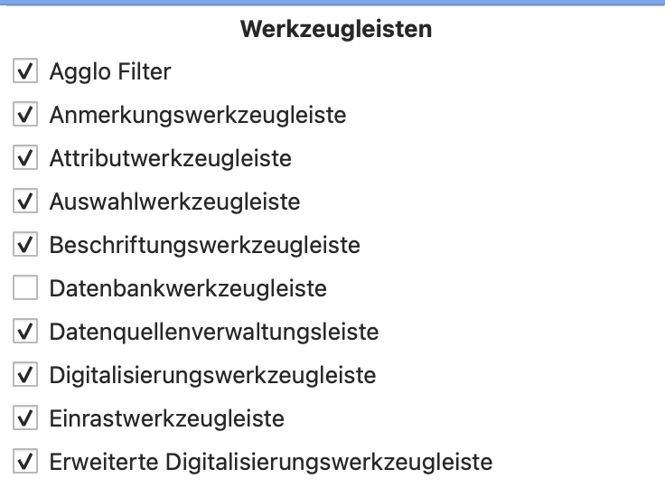 | 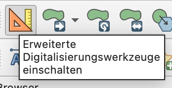 |
| 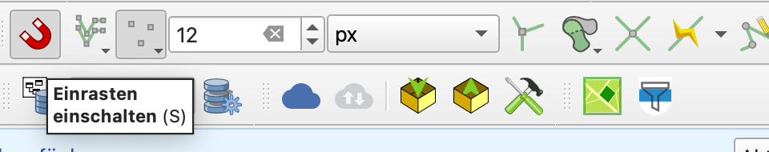 | 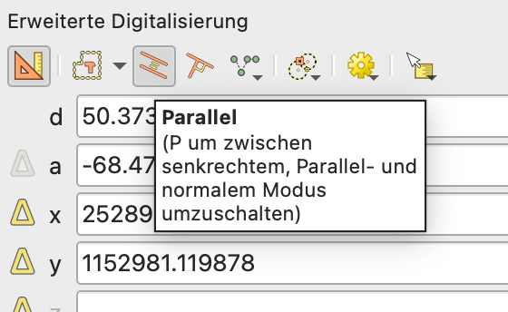 |

Activer les barres d'outils « Barre d'outils de numérisation avancée » et « Outils d'accrochage ».

En mode édition, sélectionner l'outil « Ajouter un objet » et activer les outils de numérisation avancée.

Activer l'accrochage afin de pouvoir sélectionner un segment parallèlement auquel dessiner. Sélectionner « Dessiner en parallèle ».

[<u>https://docs.qgis.org/4.2/en/docs/user_manual/working_with_vector/editing_geometry_attributes.html#parallel-and-perpendicular-lines</u>](https://docs.qgis.org/4.2/en/docs/user_manual/working_with_vector/editing_geometry_attributes.html#parallel-and-perpendicular-lines)

### 200 - Points choisis librement

Activer le mode édition sur la couche de points. Sélectionner l'outil « Ajouter un objet ponctuel ». Créer un nouveau point d'un clic sur la carte.

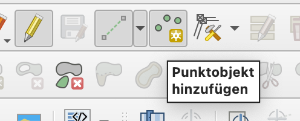

### 201 - Direction

Dans les outils de numérisation avancée, il est possible d'imposer un angle (direction), pour le dessin direct ou comme ligne de construction.

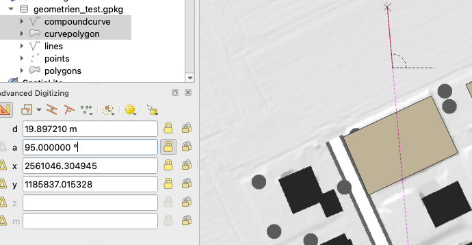

### 202 - Indication de distance

Dans les outils de numérisation avancée, il est possible d'imposer une distance, pour le dessin direct ou comme ligne de construction.

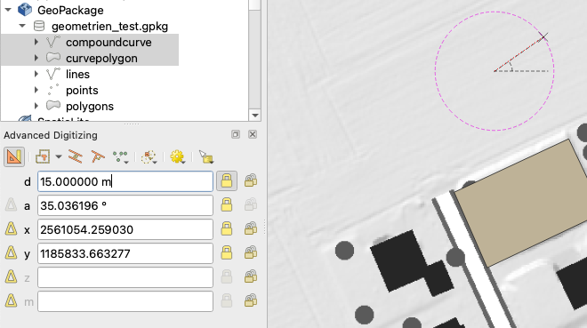

### 203 - Direction et distance

Une combinaison de direction et de distance est possible — pour le dessin direct ou comme ligne de construction.

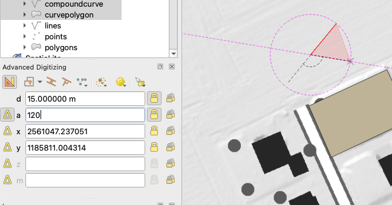

<table>
<colgroup>
<col style="width: 100%" />
</colgroup>
<tbody>
<tr>
<td>
Pour 201-203 : <a href="https://docs.qgis.org/4.2/en/docs/user_manual/working_with_vector/editing_geometry_attributes.html#absolute-reference-digitizing"><u>https://docs.qgis.org/4.2/en/docs/user_manual/working_with_vector/editing_geometry_attributes.html#absolute-reference-digitizing</u></a>

Et <a href="https://docs.qgis.org/4.2/en/docs/user_manual/working_with_vector/editing_geometry_attributes.html#construction-mode"><u>https://docs.qgis.org/4.2/en/docs/user_manual/working_with_vector/editing_geometry_attributes.html#construction-mode</u></a>
</td>
</tr>
</tbody>
</table>

### 204 - Arc de cercle via rayon/centre ou deux points de l'arc

Avec la « Barre d'outils de formes », il est possible de créer des cercles via rayon et centre ou via deux points de l'arc. La même fonction n'est pas disponible pour les arcs de cercle.

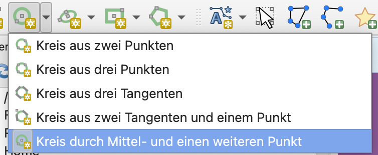

Les arcs de cercle peuvent être créés dans la « Barre d'outils de formes » à l'aide de deux points d'arc et de l'indication du rayon.

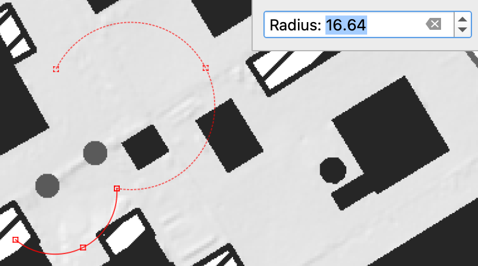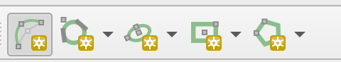

### 205 - Arc de cercle via trois points

Avec la « Barre d'outils de numérisation » standard et le paramètre « Numériser avec des courbes », l'arc de cercle est dessiné à partir de 3 points.

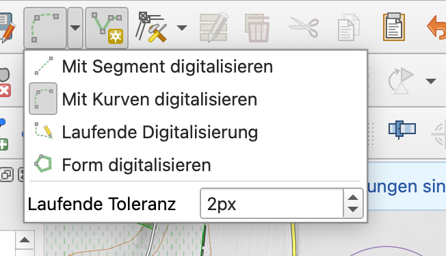 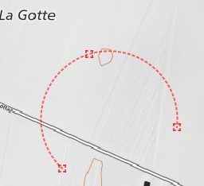

### 209 - Copier des géométries existantes

Sélectionner l'entité à copier dans la table d'attributs de la couche et **Ctrl-C**.

Passer la couche cible en mode édition et ouvrir la table d'attributs correspondante. Ensuite **Ctrl-V** et adapter les valeurs d'attributs nécessaires \> Enregistrer.

### 211 - Import de points (géométrie)

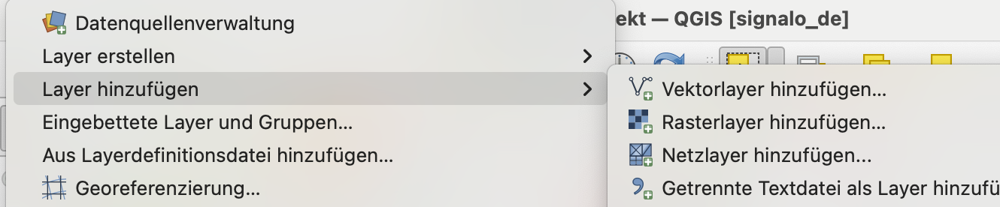

Menu **Couche \> Ajouter une couche** et sélectionner le type :

Ajouter une couche vecteur, un fichier texte délimité, une couche PostgreSQL, une couche GPX, …

Une couche peut aussi être glissée-déposée dans le projet QGIS.

### 211.1 - Éviter automatiquement les recouvrements

Dans la barre d'outils d'accrochage, activer l'« édition topologique » et définir les règles de recouvrement.

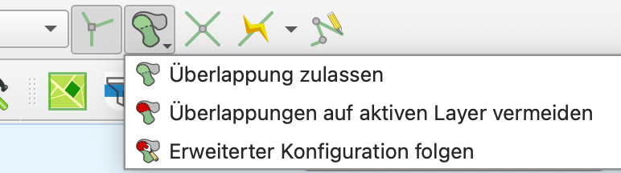

Dans la configuration avancée, les règles de recouvrement peuvent être définies individuellement par couche.

### 215 - Prolongation : libre

Avec l'outil de nœud, une géométrie peut être prolongée librement.

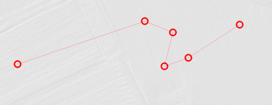 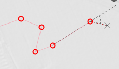

### 216 - Prolongation par indication de distance

Avec l'outil de nœud et les outils de numérisation avancée, une géométrie peut être prolongée d'une distance déterminée.

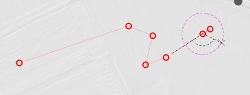

### 217 - Prolongation jusqu'à l'intersection

Activer l'outil « Rogner/prolonger un objet ». Important : l'accrochage doit être activé sur toutes les couches et tous les segments.

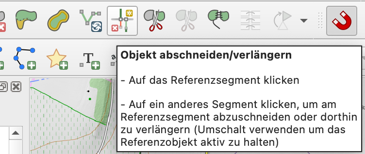

[<u>https://docs.qgis.org/4.2/en/docs/user_manual/working_with_vector/editing_geometry_attributes.html#trim-extend-feature</u>](https://docs.qgis.org/4.2/en/docs/user_manual/working_with_vector/editing_geometry_attributes.html#trim-extend-feature)

**Ou**

Dans la barre d'outils d'accrochage, activer l'accrochage aux intersections.

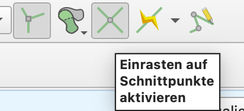

Activer le mode parallèle avec les outils de numérisation avancée et l'appliquer sur la ligne existante afin de prolonger ou raccourcir le dernier nœud jusqu'à l'intersection.

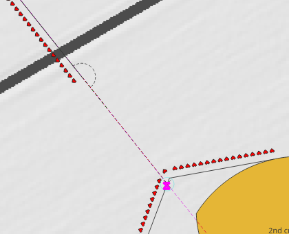

### 218 - Rognage : libre

Activer l'outil « Rogner/prolonger un objet ».

[<u>https://docs.qgis.org/4.2/en/docs/user_manual/working_with_vector/editing_geometry_attributes.html#trim-extend-feature</u>](https://docs.qgis.org/4.2/en/docs/user_manual/working_with_vector/editing_geometry_attributes.html#trim-extend-feature)

### 219 - Rognage par indication de distance

Avec l'outil de nœud et les outils de numérisation avancée, une géométrie peut être rognée d'une distance déterminée.

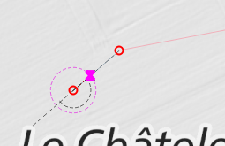

### 220 - Rognage jusqu'à l'intersection

Activer l'outil « Rogner/prolonger un objet ». Important : l'accrochage doit être activé sur toutes les couches et tous les segments.

### 221 - Rotation

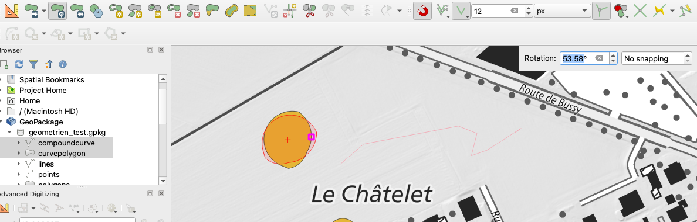

**Outils de numérisation avancée \> Rotation**.

### 222 - Déplacement

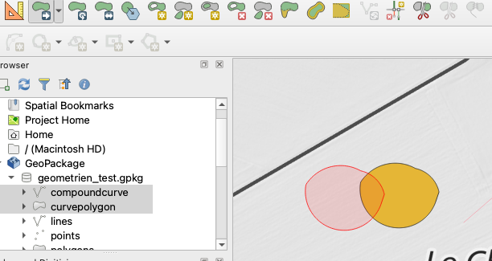

Outils de numérisation avancée \> Déplacer.

### 223 - Continuer

Continuer une ligne librement. Avec l'outil de nœud, cliquer sur le « + » à l'extrémité d'une ligne et poursuivre la ligne.

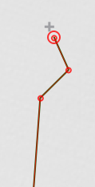

### 224 - Supprimer un nœud

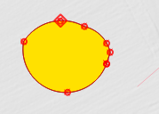 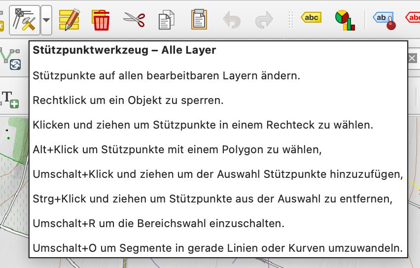

Avec l'outil de nœud, les nœuds sélectionnés peuvent être supprimés. Il est possible de sélectionner les différents nœuds avec les flèches du clavier (ou directement par clic de souris) et de les supprimer avec **Delete**.

### 225 - Insérer un nœud

Avec l'outil de nœud, de nouveaux nœuds peuvent être ajoutés (par double-clic ou via le signe « + » sur la géométrie).

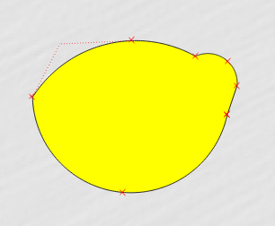 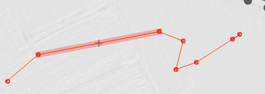

### 226 - Copier

Copie de la géométrie existante, y compris les attributs.

Soit avec l'**outil d'action** de la barre d'outils des attributs. Si « Dupliquer l'objet et le numériser » est sélectionné, la géométrie doit être redessinée, seuls les attributs sont repris de la géométrie d'origine. Avec « Dupliquer l'objet », l'objet est dupliqué exactement au même endroit que la géométrie d'origine. L'objet copié doit ensuite être déplacé (voir ci-dessous).

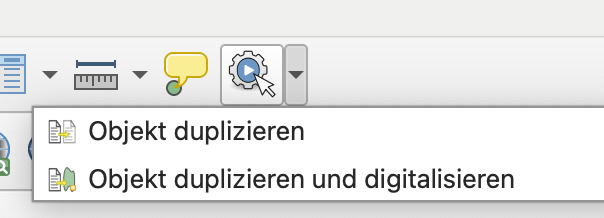

Ou via la barre d'outils de numérisation et les fonctions « Copier les objets », « Coller les objets ». Ensuite, l'objet inséré peut être déplacé via la barre d'outils de numérisation avancée.

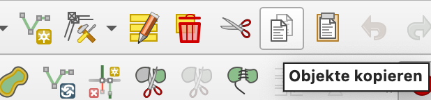 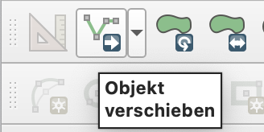

### 227 - Copier parallèlement

Comme au 209, dupliquer l'objet choisi avec l'outil d'action « Dupliquer l'objet ». Dans les outils de numérisation avancée, sélectionner « Déplacer l'objet », activer le mode parallèle (voir 199) et sélectionner le segment auquel l'objet doit être inséré parallèlement.

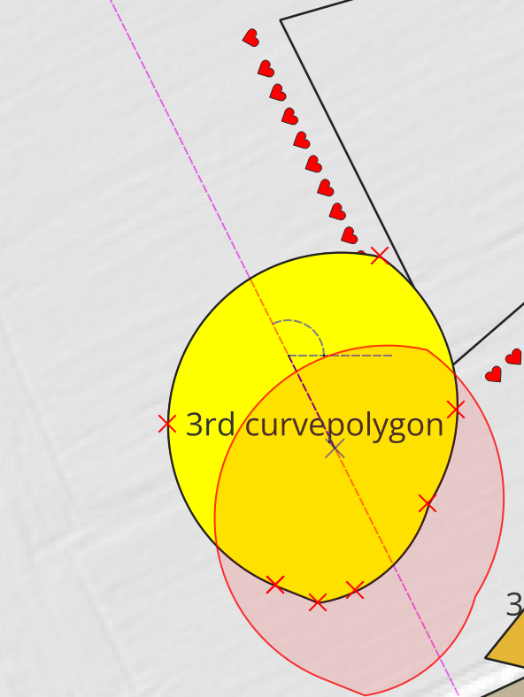

### 231 - Séparer : ligne-ligne

Outils de numérisation avancée \> Séparer des objets

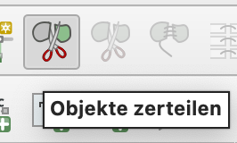 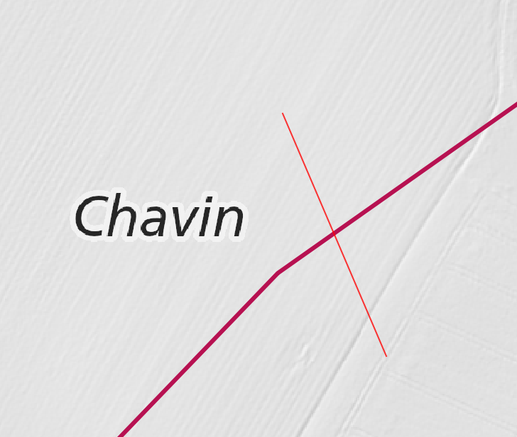 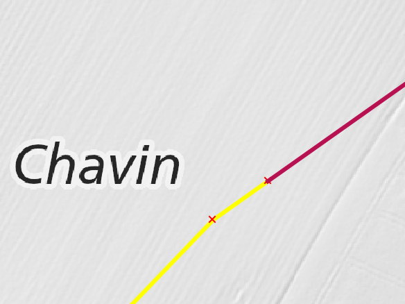

Ou, si une couche entière doit être séparée par une autre couche : Boîte à outils \> Diviser avec des lignes.

### 234 - Séparer : ligne-surface

Comme 231.

### 236 - Séparer : surface-surface

Peut être résolu par une polyligne (suffisant selon la discussion interne). Voir 231.

### 237 - Suppression de géométries

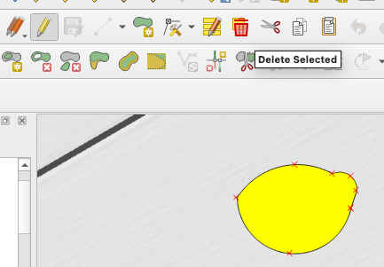

En mode édition, sélectionner la ou les géométries à supprimer avec l'outil de sélection et utiliser l'outil « Supprimer la sélection ».

### 240-242 Mesurer

240 - Mesurer une distance

241 - Mesurer un angle

242 - Mesurer une surface

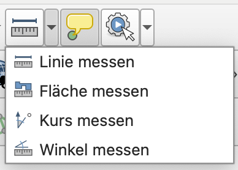

### 244-246, 250 Fonctions d'accrochage

Activer la barre d'outils d'accrochage.

244 - Fonction d'accrochage : point d'extrémité

245 - Fonction d'accrochage : nœud

246 - Fonction d'accrochage : point d'intersection

250 - Fonction d'accrochage : point central

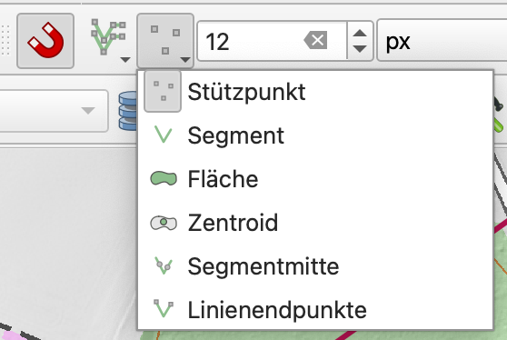 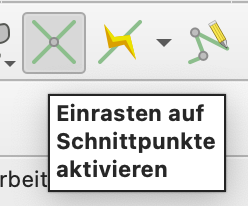

### 247 Fonction d'accrochage : intersection étendue

Tracer deux lignes de construction (parallèles) aux droites pour lesquelles l'intersection étendue doit être affichée. L'intersection peut alors être accrochée.

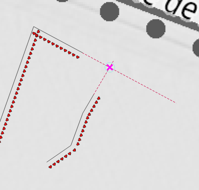

### 251 - Fonction d'accrochage : angle droit/quadrant

Dans la numérisation avancée, activer l'accrochage aux angles usuels. Ou utiliser des lignes de construction adaptées.

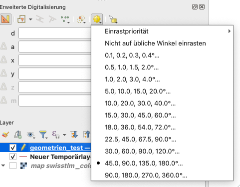

### 

### 252 - Fonction d'accrochage : arête/point le plus proche

Activer l'accrochage aux segments et aux nœuds.

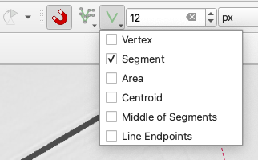

Pour trouver le point le plus proche de l'arête, activer le mode perpendiculaire dans la numérisation avancée.

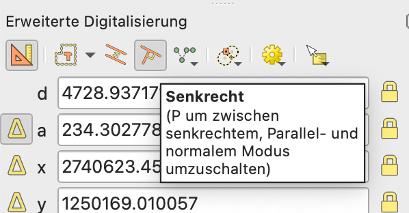

### 253 - Fonction d'accrochage : pied de la perpendiculaire

Activer l'accrochage aux segments et aux nœuds.

Pour trouver le pied de la perpendiculaire, activer le mode perpendiculaire dans la numérisation avancée.

### 254 - Fonction d'accrochage : centroïde 

Voir 250.

### 255 - Fonction d'accrochage pour les points (p. ex. point limite)

Les points sont considérés comme des nœuds ; on peut donc s'y accrocher. Dans les options avancées, les paramètres peuvent être définis individuellement pour chaque couche. Il est donc possible, par exemple, de ne s'accrocher qu'à la couche des points limites.

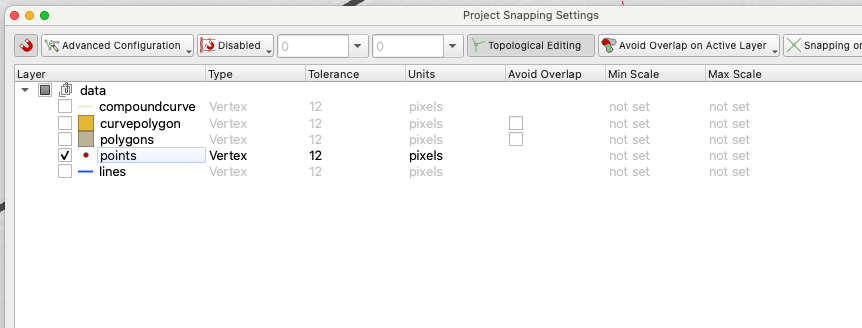

### 258 - La sélection dans la table met en évidence la géométrie sur la carte

La carte et la table sont liées.

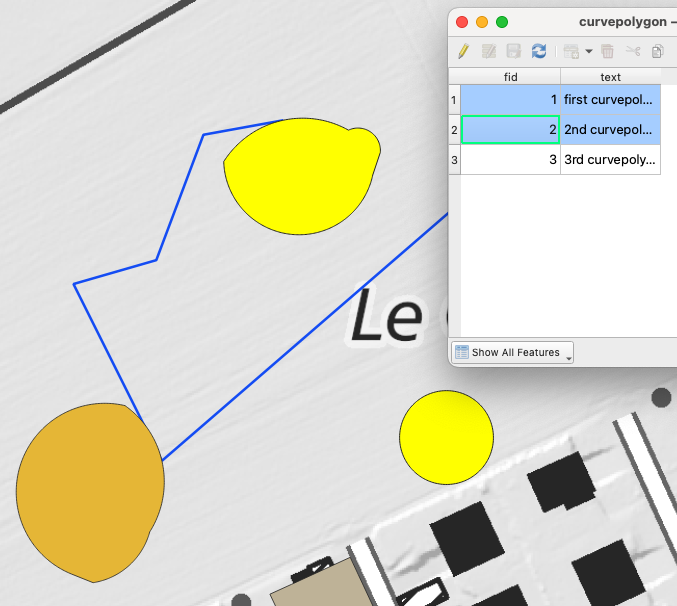

Outils de sélection dans la table : 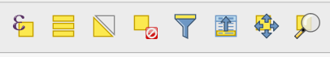

### 259 - La sélection sur la carte met en évidence dans la table

Voir 258

Outils de sélection sur la carte : 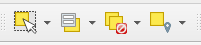

### 264 - Symbole orienté : parallèle à la ligne

Les symboles sont très flexibles. Les décalages parallèles à la ligne sont clairement possibles. Les symboles peuvent aussi être tournés.

Accéder aux paramètres via le panneau de mise en forme des couches (ou via les propriétés de la couche \> Symbologie).

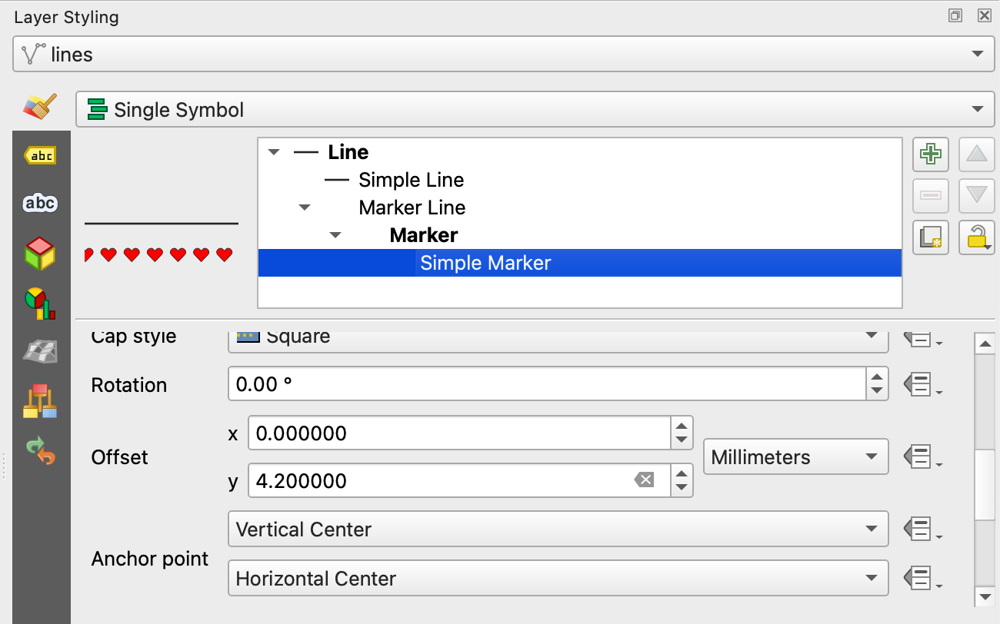

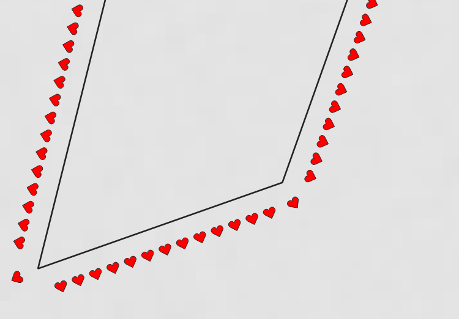

Si nécessaire, pour les lignes de marques et les lignes en pointillés, chaque marque peut être ajustée manuellement.

De plus, via le générateur de géométries, il n'y a quasiment aucune limite.

### 265 - Symbole orienté : libre

Les symboles sont très flexibles. Via le générateur de géométries, il n'y a quasiment aucune limite.

Si les symboles doivent être positionnés totalement librement, on peut recourir aux annotations/étiquettes/géométries de points supplémentaires.

### 266 - Symbole orienté : saisir l'angle de rotation

Les symboles sont très flexibles. Les symboles peuvent aussi être tournés. 

### 268 - Texte orienté : parallèle à la ligne

Par défaut, le texte est placé parallèlement à la ligne.

### 269 - Texte orienté : libre

Les étiquettes peuvent en outre être placées, tournées, etc. individuellement via la barre d'outils d'étiquetage.

### 270 - Texte orienté : saisir l'angle de rotation

La rotation peut dépendre de la géométrie (polygones), ou être verticale/horizontale. Pour les lignes, il y a aussi parallèle à la ligne, curved ou horizontal.

Ou lorsque le mode « Distance depuis le centre » est sélectionné :

